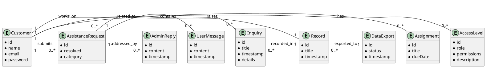
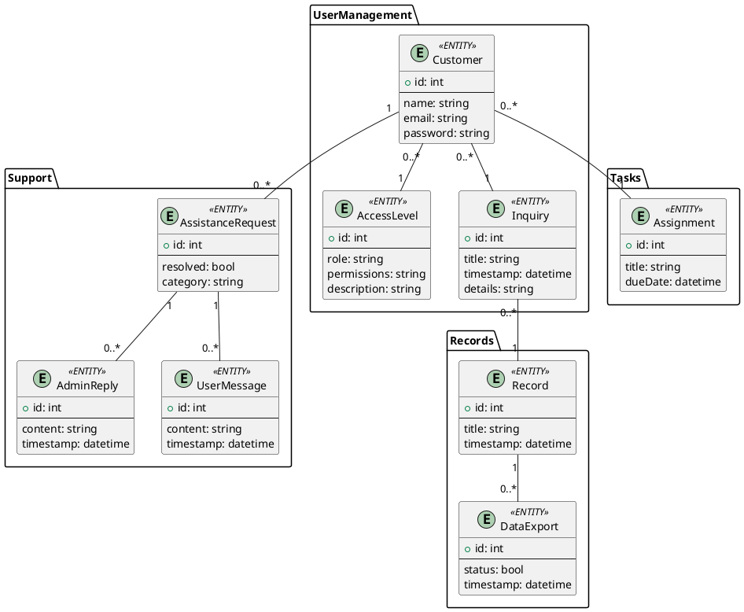

#Бізнес-об'єктивна модель

This project involves the development of:
- Business Object Model
- Entity-Relationship (ER) Diagram
- Relational Schema

## Business Object Model

###ER-діаграма

####Реляційна схема роботи 

